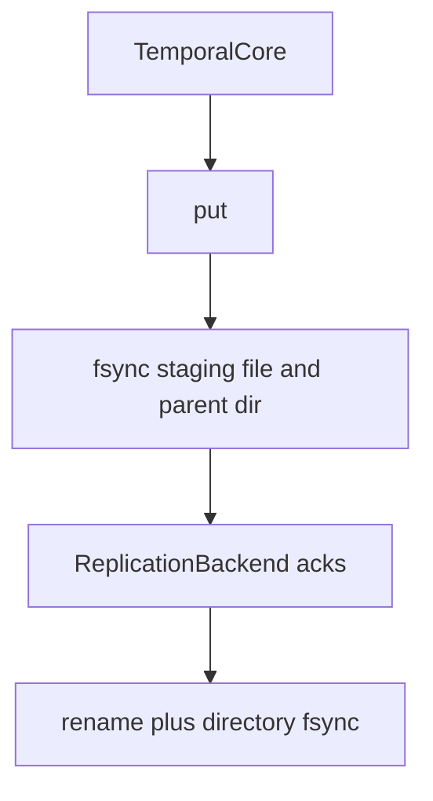

**ArkFS Build Plan – Specification v0.3**

The repository today is Phase 0: one Linux FUSE mount, a content-addressed store, and a versioned directory index. Start at [docs/maintainer.md](docs/maintainer.md). Phases 1–5 below are not implemented. There is no cluster, no TLA+ spec, no quantum-secure channel, no NFS/SMB/WebDAV server, and no UI in this tree. [docs/conformance/ipc.md](docs/conformance/ipc.md) records the same fact for the channel.

**Project Name**: ArkFS

**What Phase 0 does**: A path keeps prior versions. `unlink` / `rmdir` tombstone the live name. `arkfs mount --as-of N` is a read-only view of logical commit N. The mount is `NoPeers` and `QuorumPolicy::OwnerOnly` (local fsync, then publish). `Quorum(n)` and `AllAlwaysOn` exist and are used with `LocalQuorum`, which writes extra directories. That is not a network.

**Tech stack in this tree**:
- Rust: `arkfs_core`, `persistent_object_store`, `temporal_core`, `fuse_facade`, `simulation_harness`, the `arkfs` binary.
- Elixir: `simulation_harness` and `sim_runner`. Clock, delay field, chaos log, history-shape oracle. They do not open the store.

**IP**: MIT. See [LICENSE](LICENSE). No patent filing is part of this repository.

---

### Phase 0 — in this repository

**Module 1: SimulationHarness** (Elixir and Rust)

Records a scenario. Does not flip bytes by itself and does not simulate a power system or a network stack.

```elixir
def simulate_environment(scenario, opts \\ []) :: {:ok, SimulationResult.t()} | {:error, term()}
def inject_bit_flip(state, node_id, block_id) :: map()
def set_mars_delay(state, delay_ms) :: map()
```

The Rust crate has the same split: `ChaosInjector::inject_bit_flip` / `take_bit_flips`, and `flip_bit_in_buffer`. The store test drains the log and flips one bit of a published object. `get` and `verify_integrity` then fail.

**Module 2: PersistentObjectStore** (Rust)

`put` returns only after a local durable staging write, replication acks for the chosen `QuorumPolicy`, and `rename` plus directory `fsync` of a new or rewritten object. The FUSE process uses `open_isolated_store` (`NoPeers`). There is no InternalChannel.

```rust
pub fn put(&self, data: &[u8], quorum: QuorumPolicy) -> Result<ObjectId, ArkError>;
pub fn get(&self, id: &ObjectId) -> Result<Vec<u8>, ArkError>;
pub fn verify_integrity(&self) -> Result<IntegrityReport, ArkError>;
```

`QuorumPolicy` is `Quorum(NonZeroU32)` via `QuorumPolicy::n` (`n == 0` panics), `AllAlwaysOn`, and `OwnerOnly`.



`NoPeers` contributes zero remote acks. `OwnerOnly` is satisfied by the local write. `LocalQuorum` copies into `replicas/<name>/` on the same machine.

**Module 3: TemporalCore** (Rust)

In-memory cache of a durable index object named by the `temporal_index` anchor. Restarts reload it. Live lookup hides tombstones. `View::AsOf` returns the last version with `at <= ts`.

```rust
pub fn lookup_current(&self, path: &str) -> Result<FileHandle, ArkError>;
pub fn lookup_at_timestamp(&self, path: &str, ts: Timestamp) -> Result<FileHandle, ArkError>;
pub fn commit_branch(&self, delta: BranchDelta) -> Result<(), ArkError>;
```

Durability of bytes and of the index goes through `PersistentObjectStore` only.

---

### Not in this repository

**Phase 1 – Communications & Cluster**
- InternalChannel. No crate, no `connect` / `push_delta` / `request_historical` / `gossip_digest`, no QUIC, no post-quantum cipher, no compression codec.
- ClusterManager. No Elixir cluster, no TLA+.

**Phase 2 – Intelligent Layer & Tiering**
- IntelligentMovement, ObjectTierAdapter, NIFs. Not in the tree.

**Phase 3 – Node Facades & Mounts**
- FUSE is the only mount. `attr_map` can project attributes toward NFS, SMB3, WebDAV, and macOS. Nothing serves those protocols. No WinFsp or macFUSE mount in Phase 0. No minifilter, no File Provider.

**Phase 4 – PolicyUI**
- No dashboard and no timeline UI.

**Phase 5 – Packaging and white paper**
- Not started. The FUSE binary installs with `make install`. That is not this phase.

Do not treat the old "non-negotiable" list (TLA+, quantum-secure channel, exhaustive interplanetary simulation, zero-penalty current operations) as properties of the code. They are absent. Adding them is a new library, not a comment on Phase 0.